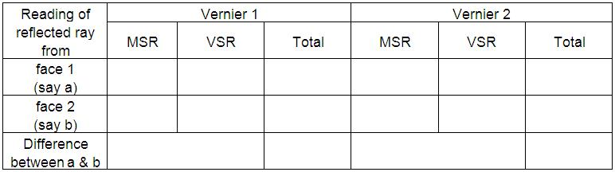

### Procedure

### Apparatus

Spectrometer, equilateral prism, sodium light etc.

### Controls
#### Switches
- **Switch On/Off Light** : Used to switch on/off the light.
- **Place Prism/Remove Prism** : This switch used to place the prism on the prism table or remove prism from the prism table.
#### Slider
- **Slit focus** : This slider used to focus the slit while looking through telescope.
- **Slit width** : Using this slider, width of the slit can be adjusted.
- **Telescope**: Using this slider one can move the telescope from its position.
- **Vernier Table**: Vernier table can be rotate using this slider.
- **Prism Table** : Prism table can be rotated using this slider. 
#### Fine Angle adjustment
- **Telescope**: This is used to fine adjust the telescope.
- **Vernier Table**: Using this slider , we can rotate fine angle.
#### Measurements
- The zoomed view of Vernier I and II can be used to note the readings.

 

### Preliminary adjustments:
#### Performing simulator
<ul>
    <li>Focus Telescope on distant object.</li>
    <li>When focus is correct, start button is activated. Then click Start button.</li>
    <li>Switch on the light by clicking Switch On Light button.</li>
    <li>Focus the slit using Slit focus slider.</li>
    <li>Adjust the slit width using Slit width slider.</li>
    <li>Coincide the slit with cross wire in the telescope.&nbsp;</li>
</ul>

#### Performing Real Lab:

1. Turn the telescope towards the white wall or screen and looking through eye-piece, adjust its position till the cross wires are clearly seen.
2. Turn the telescope towards window, focus the telescope to a long distant object.
3. Place the telescope parallel to collimator.
4. Place the collimator directed towards sodium vapor lamp. Switch on the lamp.
5. Focus collimator slit using collimator focusing adjustment.
6. Adjust the collimator slit width.
7. Place prism table, note that the surface of the table is just below the level of telescope and collimator.
8. Place spirit level on prism table. Adjust the base leveling screw till the bubble come at the centre of spirit level.
9. Clamp the prism holder.
10. Clamp the prism in which the sharp edge is facing towards the collimator, and base of the prism is at the clamp.

### Least Count of Spectrometer
ne main scale division (N)  =................minute

Number of divisions on vernier (v) = ................

L.C    = N/v = .......................minute

### To determine the angle of the Prism:
#### Performing simulator 
- Click Place Prism button.
- Place the edge of prism, pointed towards collimator.
- Move the telescope using Telescope slider up to see the slit on side. Make coincide the slit with the cross wire using fine angle adjusting slider. Then note the reading in the tabular column.
- Move the telescope in the opposite direction and do the same.
- Find the difference between two angle ie $2\theta$¸ Hence, find the angle of prism i.e $A=\theta/2$.

#### Performing Real Lab: 
1. Prism table is rotated in which the sharp edge of the prism is facing towards the collimator.
2. Rotate the telescope in one direction up to which the reflected ray is shown through the telescope.
3. Note corresponding main scale and vernier scale reading in both vernier (vernier I and vernier II).
4. Rotate the telescope in opposite direction to view the reflected image of the collimator from the second face of prism.
5. Note corresponding main scale and vernier scale reading in both vernier(vernier I and vernier II).
6. Find the difference between two readings, i.e. $\theta$
7. Angle of prism, $A= \theta/2$

 Mean $\theta$ =..................Degrees

Angle of prism  A =..................Degrees 

### To determine the Angle of minimum deviation:
#### Performing simulator

  

 

<ul>
    <li style="text-align: justify;">Rotate the vernier table so as to fall the light from the collimator to one face of the prism and emerged through another face. (refer the given figure ).&nbsp;</li>
    <li style="text-align: justify;">Turn the telescope to make the slit coincide with telescope cross wire.</li>
    <li style="text-align: justify;">Slowly rotate the vernier table by using vernier fine adjusting slider.</li>
    <li style="text-align: justify;">Note the position where the slit is stationary for some moment.</li>
    <li style="text-align: justify;">Using telescope fine adjusting slider, make coincide the slit with cross wire.</li>
    <li style="text-align: justify;">Note the reading of vernier 1 and vernier 2.</li>
    <li style="text-align: justify;">Then remove the prism using the button "Remove Prism".</li>
    <li style="text-align: justify;">Carefully turn the telescope so as to get the direct ray from collimator, make it coincide with cross wire in the telescope and again note vernier 1 and 2 readings.&nbsp;</li>
    <li style="text-align: justify;">Hence calculate the angle of minimum deviation (D) by measuring the difference between emerged ray readings and direct ray readings.</li>
</ul>

#### Performing Real Lab

<ol>
    <li>Rotate the vernier table so that the light from the collimator falling on one of the face of the prism and emerges through the other face.</li>
    <li>The telescope is turned to view the refracted image of the slit on the other face.</li>
    <li>The vernier table is slowly turned in such a direction that the image of slit is move directed towards  the directed ray; ie., &nbsp;in the direction of decreasing angle of deviation.</li>
    <li>It will be found that at a certain position, the image is stationary for some moment. Vernier table is fixed at the position where the image remains stationary.</li>
    <li>Note the readings on main scale and vernier scale.</li>
    <li>Carefully remove the prism from the prism table.</li>
    <li>Turn the telescope parallel to collimator, and note the direct ray readings.</li>
    <li>Find the difference between the direct ray readings and deviated readings. This angle is called angle of minimum deviation (D).</li>
</ol>

##  Result:

Angle of the Prism	, A = .............  
Angle of minimum deviation of the prism, D = ..............  
Refractive index of the material of the prism, n = ...........  

 

